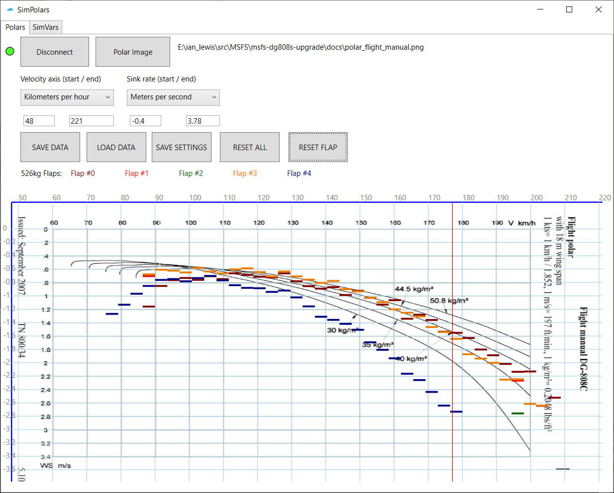

# SimPolars
MSFS polars capture application, heavily modified MSFS SimVars example app.



## Usage

We will use `EXECDIR` to mean the directory containing `SimPolars.exe`, which in this Git repo is `bin/x64/Debug` but anything is fine.

You can run `SimPolars.exe` either by double-clicking it as usual, or as a command at the Cmd prompt. The advantage of the latter is SimPolars
will write messages to the console as data is collected, giving you a clue of what's being received and can be piped to a file if that is
convenient.

* Launch SimPolars.exe & MSFS (in either order)

* Start a flight in MSFS and get the aircraft in the sky, engine off, steady cruise.

* Click the `CONNECT` button in SimPolars (and the indicator next to it should change to green).

* The SimPolars screen should begin to look like the screenshot above with the vertical red line representing
your current speed.

* To get a reliable sink/speed reading the red line needs to be reasonably steady within the area covered by the short horizontal bar
for that narrow speed range. Readings within this range will be averaged so multiple smooth readings will improve the
accuracy.

* SimPolars will ignore readings if your movement is not steady enough and you will see the red speed line jump as it skips data
coming from MSFS (which is is sampling about 3 times/second). This is because an unsteady reading can be wildly inaccurate and it
is better to not include this in the average.

* Fly as gently as you can across the entire speed range. SimPolar will move the little bars up and down as the readings come in,
averaging them with readings already taken for that speed range. This means you can gently go back and improve an area of the curve
you think is a bit unreliable.

* Using the aircraft trim will help you keep the speed steady.

* The speed/sink readings are collected PER FLAP SETTING. When you change flap it is safe to click 'RESET FLAP' to discard the first
few wild readings and then collect good data for that flap setting. SimPolar uses the MSFS flap index 0..N to report your flap setting so
note that Flap #0 is not necessarily zero degrees.

* The `RESET ALL` button does what it says. Collected data for all flap settings will be reset.

## `settings.json`

This file is in `EXECDIR` e.g. as shipped:
```
{
  "polar_image": "polar.png",
  "airspeed_min_kph": 48.0,
  "airspeed_max_kph": 221.0,
  "sink_min_ms": -0.4,
  "sink_max_ms": 3.78
}
```

`polar_image` is any PNG image file you want to use as an underlay for the chart. If you have no image then you can set `"polar_image": ""`.

`airspeed_min_kph` and `airspeed_max_kph` are the airspeeds *at the left and right edges of your image*. Your image is likely to have the chart
in the middle of it somewhere and these settings calibrate the image for SimPolars. E.g. the sample `polar.png` has the left-hand edge of the
image at 48kph, even though the image chart starts at 60kph. You should be able to approximate these numbers and fine-tune them by tweaking the
settings as seen on the screenshot above (and then save those).

`sink_min_ms` and `sink_max_ms`: same idea as for airspeed but this time it is the sink values for the top and bottom edges of the polar image.
Note the value at the *top* of the image is likely to be negative. In the example `polar.png` the sink at the top of the image is `-0.4` m/s.

You can update `settings.json` either by closing the SimPolars program and using Notepad, or you can edit the numbers on the app and click
`SAVE SETTINGS`.

# Development Info

To compile it you need:
- MS Visual Studio 2019
- MSFS SDK installed


How to use:

1. Launch MSFS
2. Launch application, request with all necessary flight model variables will be loaded as #0
3. Press "CONNECT" button
4. select Variable frequesncy option if necessary
5. Open tab "Polars"
6. Load polars image if you have aircraft aerodynamics documentation
7. Adjust min/max values, units are not available yet
8. In the game:
8.1 activate autopilot trim if it available (Z key)
8.2 reach maximum speed
8.3 level aircraft
8.4 set required total weight
8.5 set flaps position
9. Press "ENABLE DATA CAPTURE" button
10. Wait until aircraft will reach minimum speed, if necessary - disable auto trim and raise nose slowly to decrease the speed
11. Press "DISABLE DATA CAPTURE"
12. Change flaps position and repeat the test. Multiple weight tests for same flap position not supported yet.
13. Captured data can be saved as JSON file
14. to clear data of current flap, press CLEAR button

In version 0.3 request scripts was altered to support structured data responce (borrowed from FsConnect project). This method provide
best timing precision, as flight model data and absolute time value are taken from the same frame.
List of request #0 variables hardcoded in:

 * struct PlaneInfoResponse
 * List<SimvarRequest> getFlightDataVariables

So to add extra vars to this package, you need to add variables manually, respecting order.
This package is read only, so if you need to adjust some of it - add it as single simvar manually.

Additional information and latest updates available at https://msfs.touching.cloud


